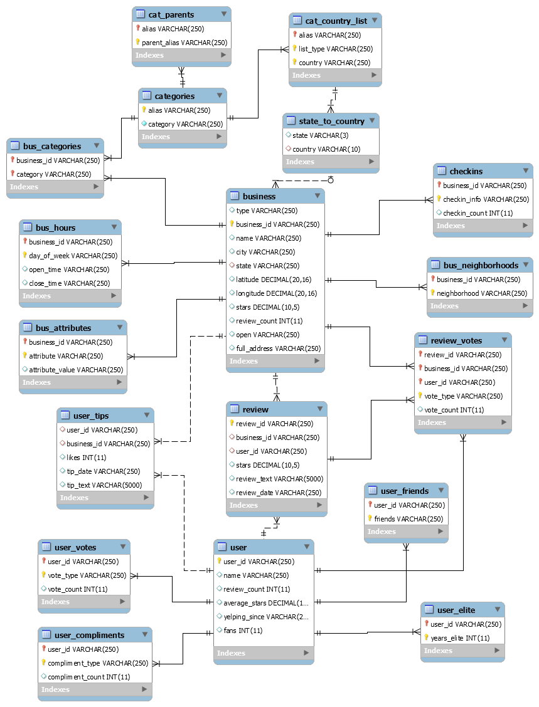
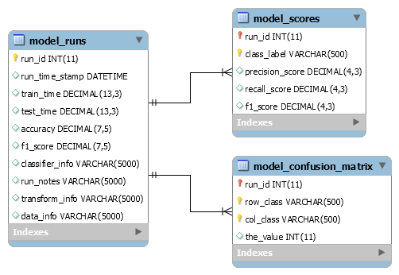

# GA Project
This project represents the majority of the work that I did to complete the GA 
Data Science class project.  

The final project turned out to be a classification problem:  
    Predict the number of stars that a review has based on the text content 
    of the reviews.  

As I approached the problem, I didn't make any assumptions about which data that I would need to use.  As a result, I spent a lot of time writing parsers and storage for *all* of the files. 

Additionally, I discovered that processing the data takes a long time. Much of my initial analysis was spent in brute-force iterating with multiple classifiers.  At first, I kept track of the results in text files but soon discovered that it was tedious fiddling with various paramaters and trying to remember the specific ones that resulted in the results I was reviewing.  Additionally, I lost several days worth of work and processing time when results exceeded the buffer.  

To solve this problem, I built some tables and code to exercise the models and save runs and context about those runs.
  
After the best 'score' was identified, the final charts and graphs were put together into Jupyter notebook and PowerPoint deck.  

# Database
There are two sets of tables in the database ProjectDB
1.  The tables to store the Yelp data
2.  The tables to store the classifier runs and scores.
 
## Yelp Data
The Yelp data is comprised of 18 tables (6 parent tables, 12 child and relationship tables).

## Run Tables
The Run data is comprised of 3 tables (1 parent, 2 child tables).

## Database creation
The DDL for creating the tables and views can be found in the ProjectDB.ddl.sql file.  The assumption is that the ProjectDB schemaa has already been created in a MySQL instance.